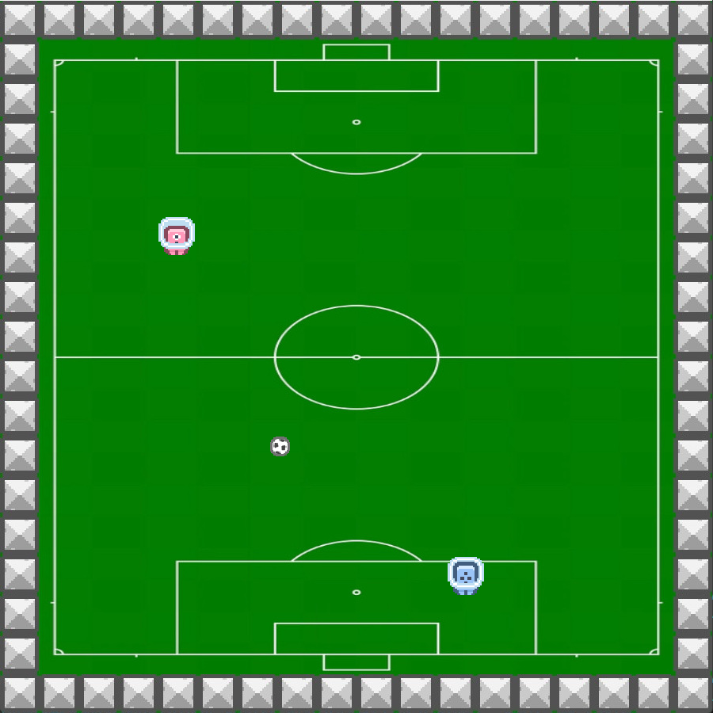

<h1>Alien Soccer</h1>
    <section>
        

            <strong>Alien Soccer</strong> is a mini-game made in Java, designed to practice my skills in game engine architecture, 
            object-oriented programming (OOP), and Java itself. The game engine was built entirely using Java's standard interfaces 
            and abstractions, including <code>JFrame</code>, <code>Canvas</code>, <code>Graphics</code>, <code>Rectangle</code>, and more.
        

    </section>
    
    <h2>Features</h2>
    <ul>
        <li>Built from scratch using Java's native libraries</li>
        <li>Object-oriented game engine design</li>
    </ul>
    <h2>Credits</h2>
    <section>
        

            All assets used in this project are licensed under <strong>CC0 (public domain)</strong>. However, I'd like to acknowledge the original creators:
        

        <ul>
            <li><strong>Sprites:</strong> <a href="https://www.kenney.nl/" target="_blank">Kenney</a></li>
        </ul>
    </section>