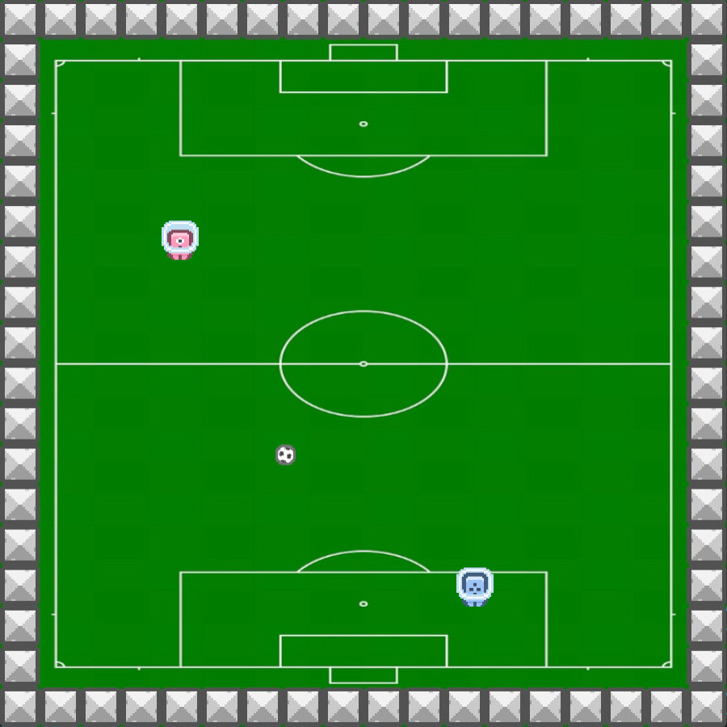

<h1>Alien Soccer</h1>
<section>
    A mini-game made in Java to practice my skills in game engine architecture OOP and Java, of course. I used only Java's interfaces and abstractions to make this game engine, like JFrame, Canvas, Java Graphics, Rectangle and more.
</section> 
    
<h2>Credits</h2>
<section>
    All assets that I used in this project are under CC0 license, however, I prefer to give the authors credit for their creations. 
    • Spites: <a href="https://www.kenney.nl/">Kenney</a>
</section>